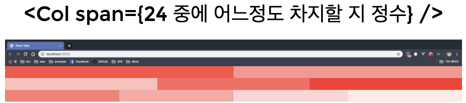
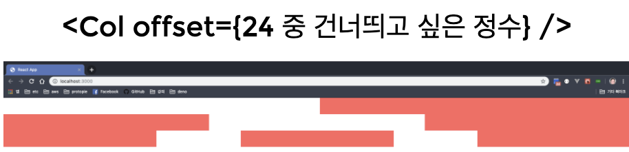

# Ant Design

---

- 컴포넌트 모음
- 이미 디자인된 라이브러리

```jsx
npx create-react-app antd-example

cd antd-example

npm i antd
```

## antd

1. antd에 css를 포함시키는 작업
2. ant design 사이트에 가서 가져올 디자인 선택 후 코드를 복사한다.
3.

```jsx
import "antd/dist/antd.css"; // <= 전역 스타일 추가 in index.js -> 여러 컴포넌트에서 사용중인 css가 들어있다.
import { DatePicker } from "antd"; // <= 리액트 컴포넌트 in App.js
```

```jsx
import React from "react";
import ReactDOM from "react-dom";
import "antd/dist/antd.css"; // antd에 css를 포함시키는 작업
import "./index.css";
import App from "./App";
import reportWebVitals from "./reportWebVitals";

ReactDOM.render(
  <React.StrictMode>
    <App />
  </React.StrictMode>,
  document.getElementById("root")
);

// If you want to start measuring performance in your app, pass a function
// to log results (for example: reportWebVitals(console.log))
// or send to an analytics endpoint. Learn more: https://bit.ly/CRA-vitals
reportWebVitals();
```

```jsx
import "./App.css";
import { DatePicker } from "antd";

function App() {
  return (
    <div className="App">
      <DatePicker />
    </div>
  );
}

export default App;
```

위 코드는 전역css로 사용하기 때문에 불필요한 코드도 사용, 발생된다는 문제가 있다. 만약 이 문제를 해결하고자 지역css로 사용하려고 한다면 아래와 같이 지역 코드로 수정 및 찾아와 사용해야 한다.

```jsx
import DatePicker from "antd/es/date-picker";
import "antd/es/date-picker/style/css"; // 매번 가져오기 귀찮다..!
```

- **매번 찾아야 하는 것이 번거로울 때 사용할 수 있는 방법!**

하지만 eject를 해야 한다...!

```jsx
npm run eject
npm install babel-plugin-import --save-dev
```

```jsx
{
  ...
  "babel": {
    "presets": [
      "react-app"
    ],
    "plugins": [
      [
        "import",
        {
          "libraryName": "antd",
          "libraryDirectory": "es",
          "style": "css"
        }
      ]
    ]
  },
  ...
}
```

바벨 플러그인을 사용하는 것..!

---

antd 아이콘 ui 사용

```jsx
npm install @ant-design/icons
```

```jsx
import { Button } from "antd";
import { HeartOutlined } from "@ant-design/icons"; // icon inport

export default class LoadingButton extends React.Component {
  state = {
    loading: false,
  };

  startLoading = () => {
    console.log("start");
    this.setState({ loading: true });
    setTimeout(() => {
      this.setState({ loading: false });
    }, 1000);
  };

  render() {
    const { loading } = this.state;
    return (
      <Button
        type="primary"
        size="large"
        icon={<HeartOutlined />} // icon 사용하기
        loading={loading}
        onClick={this.startLoading}
        style={{
          width: 50,
        }}
      />
    );
  }
}
```

## table



```jsx
import { Row, Col } from "antd";

const colStyle = () => ({
  height: 50,
  backgroundColor: "red",
  opacity: Math.round(Math.random() * 10) / 10,
});

function App() {
  return (
    <div className="App">
      <Row>
        {" "}
        {/*span의 총합은 24여야 한다.*/}
        <Col span={12} style={colStyle()} />
        <Col span={12} style={colStyle()} />
      </Row>
      <Row>
        <Col span={8} style={colStyle()} />
        <Col span={8} style={colStyle()} />
        <Col span={8} style={colStyle()} />
      </Row>
      <Row>
        <Col span={6} style={colStyle()} />
        <Col span={6} style={colStyle()} />
        <Col span={6} style={colStyle()} />
        <Col span={6} style={colStyle()} />
      </Row>
    </div>
  );
}

export default App;
```

- span의 총합은 24여야 한다.
- 24를 100%로 라고 할 때 한 칸의 비율을 나타내는 숫자이다.


```jsx
import { Row, Col } from "antd";

function MyCol({ span }) {
  return (
    <Col span={span}>
      <div style={{ height: 50, backgroundColor: "red", opacity: 0.7 }} />
    </Col>
  );
}

export default function App() {
  return (
    <div className="App">
      <Row gutter={16}>
        <MyCol span={12} />
        <MyCol span={12} />
      </Row>
      <Row gutter={16}>
        <MyCol span={8} />
        <MyCol span={8} />
        <MyCol span={8} />
      </Row>
      <Row gutter={16}>
        <MyCol span={6} />
        <MyCol span={6} />
        <MyCol span={6} />
        <MyCol span={6} />
      </Row>
    </div>
  );
}
```

- col이 24일 때, 거터는 16을 지정해야 알맞은 비율이기 때문에 거터의 기본값은 16이다.
- , + (8의 정수)

---



```jsx
import { Row, Col } from "antd";

function MyCol({ span, offset }) {
  return (
    <Col span={span} offset={offset}>
      <div style={{ height: 50, backgroundColor: "red", opacity: 0.7 }} />
    </Col>
  );
}

export default function App() {
  return (
    <div className="App">
      <Row gutter={16}>
        <MyCol span={12} offset={12} />
      </Row>
      <Row gutter={16}>
        <MyCol span={8} />
        <MyCol span={8} offset={8} />
      </Row>
      <Row gutter={16}>
        <MyCol span={6} />
        <MyCol span={6} offset={3} />
        <MyCol span={6} offset={3} />
      </Row>
    </div>
  );
}
```

---

## flex 방식


```jsx
import { Row, Col } from "antd";

function MyCol({ span, offset }) {
  const opacity = Math.round(Math.random() * 10) / 10;
  return (
    <Col span={span} offset={offset}>
      <div style={{ height: 50, backgroundColor: "red", opacity }} />
    </Col>
  );
}

export default function App() {
  return (
    <div className="App">
      <Row
        style={{
          height: 300,
        }}
        justify="start"
        align="top"
      >
        <MyCol span={4} />
        <MyCol span={4} />
        <MyCol span={4} />
        <MyCol span={4} />
      </Row>
    </div>
  );
}
```
