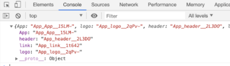

# CSS module and SASS module

`import styles from ‘/app.module.css’;` → `console.log(styles);`

를 진행하면 콘솔창에 프로퍼티키와 값이 뜬다.

여기서 프로퍼티 값의 뜻은 아래와 같다.



```jsx
 [filename]\_[classname]\_\_[hash]
```

```jsx
<div className={styles["App"]}>
```

와 같이 직접적인 이름이 아닌 styles를 참고하여 className을 작성한다.

→ app_hearder와 같이 해당 내역을 상세히 적지 않아도 module의 프로퍼티 값은 `[filename]\_[classname]\_\_[hash]` 와 같이 작성되기 때문에 해당 className이 곂치는 오류가 발생하지 않는다.

```jsx
import logo from "./logo.svg";
import styles from "./App.module.css";

const App = () => {
  console.log(styles);
  return (
    <div className={styles["App"]}>
      <header className={styles["header"]}>
        
        <p>
          Edit <code>src/App.js</code> and save to reload.
        </p>
        <a
          className={styles["link"]}
          href="https://reactjs.org"
          target="_blank"
          rel="noopener noreferrer"
        >
          Learn React
        </a>
      </header>
    </div>
  );
};

export default App;
```

클릭하면 클래스네임이 추가되어 style이 변환됨 → 1초 후 다시 클래스네임 제거

```jsx
import styles from "./Button.module.css";

export default class Button extends React.Component {
  state = {
    loading: false,
  };

  startLoading = () => {
    console.log("start");
    this.setState({ loading: true });
    setTimeout(() => {
      this.setState({ loading: false });
    }, 1000);
  };

  render() {
    const { loading } = this.state;
    return (
      <button
        className={
          loading ? `${styles.button} ${styles.loading}` : styles.button
        }
        {...this.props}
        onClick={this.startLoading}
      />
    );
  }
}
```

아직 훅을 배우지 않았기 때문에 function이 아닌 class로 사용하였다.

하지만 이런 코드는 굉장히 비효율적으로 느껴짐 → 다른 방법이 있다!! → `npm i classnames`

```jsx
console.log(classnames("foo", "bar", "baz")); // foo bar baz
```

```jsx
import classNames from "classnames";

console.log(classNames({ foo: true }, { bar: true })); // "foo bar"
console.log(classNames({ foo: true }, { bar: false })); // "foo"
console.log(classNames(null, false, "bar", undefined, 0, 1, { baz: null }, "")); // "bar 1" 거짓인 값은 표시되지 않는다!!!

console.log(classNames(styles.button, styles.loading)); // Button_button__2Ce79 Button_loading__XEngF
```

```jsx
  className={
    loading ? `${styles.button} ${styles.loading}` : styles.button
  }

className={
	classNames(style["button"],{
		loading:this.state.loading,
	}
}
// 일반 css파일을 import할때는 상관이 없으나 module.css파일을 import할 때에는 loading 자체가 cclassName이 되어 버리기 때문에 위 방법은 사용할 수 없다!!
```

- 그래서 classnames가 지원하는 모듈 사용방법이 있다.

```jsx
import classNames from "classnames/bind";

const cx = classNames.bind(styles);

console.log(cx("button", "loading")); // Button_button__2Ce79 Button_loading__XEngF
console.log(cx("button", { loading: false })); // Button_button__2Ce79
```

```jsx
import styles from "./Button.module.css";
import classNames from "classnames/bind";

const cx = classNames.bind(styles);

export default class Button extends React.Component {
  state = {
    loading: false,
  };

  startLoading = () => {
    console.log("start");
    this.setState({ loading: true });
    setTimeout(() => {
      this.setState({ loading: false });
    }, 1000);
  };

  render() {
    const { loading } = this.state;
    return (
      <button
        className={cx("button", { loading })} //{loading} : loading 을 작성해야 하는데 js문법에서 동일한 문구는 굳이 작성하지 않아도 되기 떄문에 loading하나만 작성함!!
        {...this.props}
        onClick={this.startLoading}
      />
    );
  }
}
```
