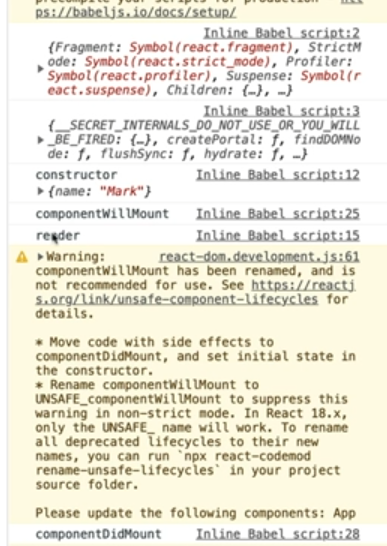
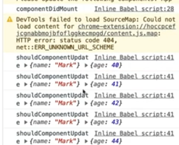
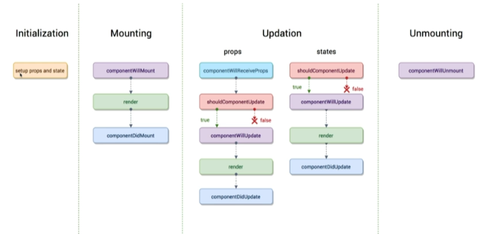

# [component LifeCycle] 컴포넌트의 생성부터 완료 후 삭제

강의: 패스트캠프
생성일: 2022년 2월 5일 오전 12:21
수정일: 2022년 2월 14일 오후 11:43
스킬 & 언어: react
중요도: 💜

***참고***

- 

---

**Component Lifecycle**

탄생부터 죽음까지 여러지점에서 개발자가 작업이 가능하도록 메소드를 오버라이딩 할 수 있게 함!

## 16.3V 이전의 라이프사이클 훅


### ***초기화 → render***

**Initialization**

컨스트럭터를 의미,  Props 설정, states의 초기값이 설정되는 구간을 의미

**Mounting**

`ComponentWillMount`, render가 되기 직전의 상태를 의미

`render`, 화면에 표시되는 것을 의미

`componentDidMount`, render가 된 직후를 의미

---

**Updation - Props, states가 변경되는 것을 의미 (→ re render)**

`shouldComponentUpdate`, component의 update 필요 여부를 확인한다. (→ true, false의 결과를 도출)

`componentWillUpdate`, `shouldComponentUpdate`의 결과에 따라 실제로 render가 되게할지 아닐지 조절하게 함 (불필요한 랜더를 방지함, 성능최적화에 도움이 된다. )

---

**unMountion -  사라진 후는 설정이 불가능하다.**

`ComponentWillUnMount`, 사라지기 직전을 의미

  

```jsx
class App extends React.Component{
        state = {
          age:39,
        }
				interval=null; // clearInterval을 정의해주기 위해 작성하였다.
				// 최초의 constructor가 가장 먼저 불린다.
        constructor(props){
          super(props);
          console.log('constructor');
        }
        render(){
					//render
          console.log('render');
          return(
            <div>
              <h2>Hello {this.props.name} - {this.state.age}</h2>
            </div>
          )
        }
				//따로 지정을 해주지 않아도 componentWillMount는 랜더가 되기 직전의 상태이기 때문에 render보다 먼저 불리운다.
				componentWillMount(){
					console.log('componentWillMount');
				}
				// 랜더가 된 직후의 Hook이기 때문에 Will 이후에 작성했더라도 Will -> render -> Did
				componentDidMount(){
					console.log('componentDidMount');
					//타이머, API 요청등의 행위를 함
					setInerval( ()=>{
						console.log("setInterval");
						this.setState(state => ({...state, age:state.age}));
					},1000);

				}
      }

      ReactDOM.render(<App name="Mark" />, document.querySelector('#root'));
```




## Component Props, state 변경 (<v16.3)

```jsx
componentWillReceiveProps(nextProps){
          // 바뀔 Props가 들어온다.
          console.log('componentWillReceiveProps', nextProps);
        }

        shouldComponentUpdate(nextProps, nextState){
          // true, false를 return한다.
          console.log('shouldComponentUpdate', nextProps, nextState);
          // ture가 나온다면 다음단계로 진행되나 false를 하면 stats나 Props가 변경됐음에도 불구하고 render가 다시 진행되지 않는다.
          // 따라서 조건문을 사용하여 작성하면 효율적인 코드 작성이 가능하다.
          return false;
        }
        // render가 발생되기 전이기 때문에 next~~
        componentWillUpdate(nextProps, nextState){
          console.log('componentWillUpdate', nextProps, nextState);
        }

        componentDidUpdate(prevProps, prevState){
          console.log('componentDidUpdate', nextProps, nextState);
        }
```

**componentWillReceiveProps**

- Prps를 새로 지정했을 때 바로 호출된다.
- state의 변경에 반응하지 않음
    - Props의 값에 따라 변경해야 한다면 `setState`를 이용해야한다. (하지만 다음 이벤트로 진행하는 것이 아닌 한 번에 변경된다.)

**shouldComponentUpdate**

- Props, state 각각 따로 변경되거나 같이 변경되어도 호출된다.
- newProps, newState를 인자로 사용한다.
- return type → boolean
    - return이 ture면 render, false면 render가 호출되지 않으며 작성하지 않는다면 기본은 ture이다.

**componentWillUpdate**

- component가 reRendering되기 전에 불린다.
- !! setState를 사용하면 안됨 !!

**render**

**componentDidUpdate**

- component가 reRendering을 마치면 불린다.





false를 했기 때문에 화면은 변경되지 않으나 값은 변화하고 있다. (render가 되고 있지 않기 때문!!!)

## Component 언마운트 (<v16.3)

실제 언마운트가 된 이후엔 (컴포넌트가 삭제되기 때문에 이벤트를 발생시키지 않음!) 처리가 불가능하기 때문에 언마운트가 실행되기 직전에 사용하는 Hook

- 컴포넌트가 사용하는 메모리를 정리
- API 요청에 대한 응답을 받기 전 언마운트를 한다면 API를 받지 않겠다는 처리를 진행해야 한다.

```jsx
componentDidMount(){
	console.log('componentDidMount');
	//타이머, API 요청등의 행위를 함
	this.interval = setInerval( ()=>{
		console.log("setInterval");
		this.setState(state => ({...state, age:state.age}));
	},1000);

componentWillUnmount(){
          // setInterval이 실행되고 있는데! unmount에서 clearInerval을 진행해주지 않는다면 컴포넌트가 언마운트 되어도 계속해서 setInterval이 실행된다. -> 메모리 과다 사용!!
          clearInterval(interval)
        }
```

컴포넌트가 언마운트된다면 clearInterval이 진행된다.

- 코드 전문보기
    
    ```jsx
    class App extends React.Component{
            state = {
              age:39,
            }
    				interval=null; // clearInterval을 정의해주기 위해 작성하였다.
    				// 최초의 constructor가 가장 먼저 불린다.
            constructor(props){
              super(props);
              console.log('constructor');
            }
            render(){
    					//render
              console.log('render');
              return(
                <div>
                  <h2>Hello {this.props.name} - {this.state.age}</h2>
                </div>
              )
    				//따로 지정을 해주지 않아도 componentWillMount는 랜더가 되기 직전의 상태이기 때문에 render보다 먼저 불리운다.
    				componentWillMount(){
    					console.log('componentWillMount');
    				}
    				// 랜더가 된 직후의 Hook이기 때문에 Will 이후에 작성했더라도 Will -> render -> Did
    				componentDidMount(){
    					console.log('componentDidMount');
    					//타이머, API 요청등의 행위를 함
    					setInerval( ()=>{
    						console.log("setInterval");
    						this.setState(state => ({...state, age:state.age}));
    					},1000);
            componentWillReceiveProps(nextProps){
              // 바뀔 Props가 들어온다.
              console.log('componentWillReceiveProps', nextProps);
            }
    
            shouldComponentUpdate(nextProps, nextState){
              // true, false를 return한다.
              console.log('shouldComponentUpdate', nextProps, nextState);
              // ture가 나온다면 다음단계로 진행되나 false를 하면 stats나 Props가 변경됐음에도 불구하고 render가 다시 진행되지 않는다.
              // 따라서 조건문을 사용하여 작성하면 효율적인 코드 작성이 가능하다.
              return false;
            }
            // render가 발생되기 전이기 때문에 next~~
            componentWillUpdate(nextProps, nextState){
              console.log('componentWillUpdate', nextProps, nextState);
            }
    
            componentDidUpdate(prevProps, prevState){
              console.log('componentDidUpdate', nextProps, nextState);
            }
            componentWillUnmount(){
              // setInterval이 실행되고 있는데! unmount에서 clearInerval을 진행해주지 않는다면 컴포넌트가 언마운트 되어도 계속해서 setInterval이 실행된다. -> 메모리 과다 사용!!
              clearInterval(interval)
            }
            
          }
          ReactDOM.render(<App name="Mark" />, document.querySelector('#root'));
    ```