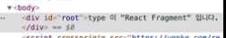
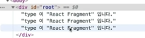
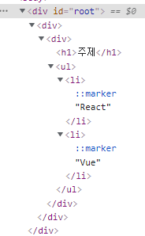

# [component] 컴포넌트 생성부터 사용방법 React.createElement&jsx&babel

강의: 패스트캠프
메모: 클래스 컴포넌트와 함수영 컴포넌트 생성 방법 & React.createElement로 컴포넌트 만들기 및 한계 & jsx, babel
생성일: 2022년 2월 1일 오후 9:18
수정일: 2022년 2월 2일 오후 1:27
스킬 & 언어: react

***오늘 진도***

- 클래스 컴포넌트와 함수형 컴포넌트 생성 방법
- React.createElement로 컴포넌트 만들기 및 한계
- React.createElement 를 간편하게 작성할 수 있는 jsx과 babel

---

# hooks

hooks 이전에는 컴포넌트 내부에 상태가 있다면 class 를 만들어 사용 컴포넌트 내부에 상태가 있다면 라이프 사이클과 관계가 있을 때 class, 없을 때 function을 사용하였다.

**hooks 이후엔 class와 function 을 구분하지 않고 사용하게 되었다.** → 하지만 이 두가지는 엄연히 다른 것으로 개념은 알고 있는 것이 좋음!

# class component

```jsx
import React from 'react';
// 리액트라는 라이브러리를 리액트라는 이름으로 가져오겠다는 뜻, es6문법이다. CDN방식이 아닌 import 방식으로 전역객체로 불러오는 방식!

class ClassComponent extends React.Component{
	render(){
		return (<div>Hello</div>); // jsx는 후에 react.createElement로 변경되기 떄문에 imoprt react를 진행해주어야 한다.
	}
}
```

하단 코드는 `ClassComponent`를 다른 곳에서 사용하면 그것에 대한 결과가 `<div>HELLO!!</div>`로 랜더된다는 의미를 가진다.

***정의*  (class ClassComponent extends React.Component-> render -> return)**

```jsx
<script type="text/babel">

//클래스 클래스이름 / 리액트컴포넌트를사용하겠다는의미-> extends 라는 키워드를 통해 React.Component에게 상속 받음
      class ClassComponent extends React.Component{
//React.Component를 상속받은 후엔 메소드 render를 정의해주어야 한다.
	render(){
		//render는 return을 해주어야 한다. 
		return <div>HELLO!!</div>
	}
}

</script>
```

***사용***

```jsx
ReactDOM.render(
	<classComponent />,
	document.querySelector('#root')
)
```

# function component

***정의 1  - function keyword를 이용해 정의 하는 방법***

```jsx
//인자가 있을 수도 있고, 없을 수도 있으나 리턴은 필수이다.
function FunctionComponent(){
	return <div>HELLO!!!</div>
}
```

***정의 2 - arrow function을 만드는 방법***

```jsx
//화살표 함수는 리턴만 있다면 중괄호와 리턴을 생략할 수 있다.
const FunctionComponent = ()=>{
	return <div>HELLO!!!</div>
}

//생략된 함수식
const FunctionComponent = ()=><div>HELLO!!!</div>
```

***사용***

```jsx
ReactDOM.render(	<FunctionComponent/>,document.querySelector('#root'))
```

# React.createElement로 컴포넌트 만들기

```jsx
React.createElement(
        type,//태그이름 || 리액트 컴포넌트 || React.Fragment
        [props],//리액트 컴포넌트에 넣어주는 데이터 객체
        [... children]//컴포넌트의 자식 요소들
      )

사용 예시 -> React.createElement('h1', null, `type이 "태그이름 문자열" 입니다."`)
```

컴포넌트 및 일반 태그들도 React.createElement로 만들어 내 실제 돔에 그릴 수 있음

- 태그이름 문자열 type

```jsx
ReactDOM.render(
        React.createElement("h1", null, `type이 "태그이름 문자열" 입니다.`)
			// <h1>type이 "태그이름 문자열"입니다.</h1>
        document.querySelector("#root")
      );
```

- 리액트 컴포넌트 type

```jsx
const Component = ()=>{
        return React.createElement('p', null, `type이 "React 컴포넌트"입니다.`)
      }
ReactDOM.render(
  React.createElement(Component, null, null) // 실제론 <Component />로 작성된다.
  document.querySelector("#root")
);
```

실제로 표현되는 것은 retuen 뒤에 작성한 코드이다. → 컴포넌트를 createElement를 할 때 두번째, 세번째 인자를 넣어준다.(null)

- React.Fragment

```jsx
ReactDOM.render(
        React.createElement(
          React.Fragment,
          null,
          `type이 "React.Fragment"입니다.`
        ),
        document.querySelector("#root")
      )
```





다른 태그로 묶지 않고, 작성한 코드 그대로 집어넣는다.

`React.Fragment` 가 없었을 때는 태그가 있어야만 하위 요소를 작성할 수 있었다.  하지만 Fragment를 사용하면 태그로 한 번더 묶을 필요가 없고 아래 이미지와 같이 배열처럼 여러줄을 삽입시킬 수도 있다.

# createElement 의 한계



```jsx
ReactDOM.render(
        //여태는 태그를 하나씩만 생성했다.
        React.createElement("div", null,
          React.createElement('div', null,
            React.createElement('h1',null,"주제"),
            React.createElement('ul', null,
              React.createElement('li', null, "React"),
              React.createElement('li', null, "Vue")
          )
        )
      ), 
        document.querySelector("#root")
      )
```

한개를 작성할 때와 달리 복잡한 형태를 creatElement를 활용해 작성한다면 가독성이 좋지 못하다.

# jsx

위 React.createElement의 복잡한 코드를 해결하기 위해 순수한 JS가 아닌 변환된 코드를 사용한다. → babel(브라우저가 이해할 수 있는 JS로 변환시켜주는 역할)에 의해 jsx가 순수 JS로 변환(컴파일, 트랜스파일)된다.

***JSX를 사용하는 이유***

- React.createElement보다 가독성이 좋다.
- babel과 같은 컴파일 과정에서 문법적 오류를 인지하는 것이 비교적 쉽다. (오류창에 직접적으로 알려줌)

***jsx 문법***

- 최상위 요소가 하나여야 합니다.
- 최상위 요소 리턴하는 경우 ( ) 로 감싸야 합니다.
- 자식들을 바로 랜더링하고 싶으면, `<></>`를 사용합니다. => 혹은 ReactDOM의 기능인 `Fragment` 를 사용해도 좋다.
- 자바스크립트 표현식을 사용하려면 `{표현식}` 를 이용합니다. `const title=”주제!”` `{title}`
- if 문은 사용할 수 없습니다.
    - 삼항 연산자 혹은 && 를 사용합니다.
- style 을 이용해 인라인 스타일링이 가능합니다.
- class 대신 className 을 사용해 class 를 적용할 수 있습니다.
- 자식요소가 있으면, 꼭 닫아야 하고, 자식요소가 없으면 열면서 닫아야 `` 합니다.

***바벨 CDN***

```jsx
<script src="https://unpkg.com/@babel/standalone/babel.min.js"></script>
<script type="text/babel"></script>
```