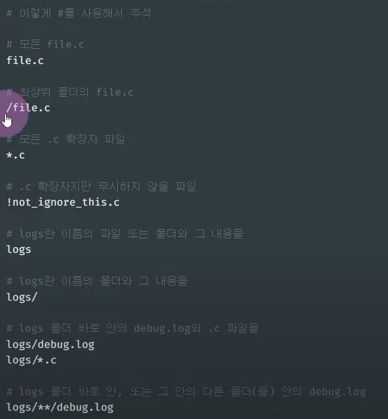
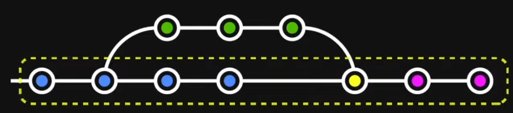
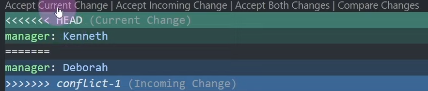
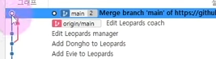
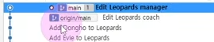

# [git, github] 깃과 깃허브 사용방법 및 개념

강의: 유튜브강의
생성일: 2022년 2월 3일 오후 1:11
수정일: 2022년 2월 4일 오전 1:19
스킬 & 언어: 기본 지식

***최종 정리***

- 

***오늘 진도***

- 

***참고***

[[깃 끝판왕 강좌] 제대로 파는 Git & GitHub](https://www.youtube.com/watch?v=1I3hMwQU6GU)

---

`git` : 버전관리를 위한 소프트웨어 (버전관리, 브랜치)

`github` : git으로 원격 전송된 프로젝트가 저장되는 공간을 제공하는 서비스

- 깃 설치 전, 리눅스 환경과 유사한 git bash를 설치
- git GUI 프로그램으로 [sourcetree](https://www.sourcetreeapp.com/) 추천
- vsCode 터미널 사용 시 기본 cli가 아닌 git bash 등 다른 cli로 변경하고 싶을 땐 `Select Default Profile` 에서 변경

# git

## git 초기 설정

 

- 본인 이메일 및 이름 설정하는 방법

```jsx
git config --global user.name "(내 이름)" // git config --global user.name로 확인
git config --global user.email"(내 이메일)" //git config --global user.email로 확인
```

`“()”` 본인 이름 및 이메일을 작성하지 않는 다면 새로 작성하는 것이 아닌 확인 명령이다.

- 기본 브랜치명 변경

```jsx
git config --global init.defaultBranch main
```

main은 브랜치의 이름이다.

기존 master에서 main 등으로 변경 중이라고 함. 

- git 숨긴 폴더 생성 확인

```jsx
git init
```

`.git` 이라는 폴더를 삭제하면 git 관리 내역이 사라진다. 브랜치 이동도 불가능함.

- .git 폴더는 commit 등의 대한 git 내용이 저장되는 공간이므로 .git폴더를 따로 복사했을 때 reset으로 현재 작업내역을 삭제하더라도 폴더를 붙여넣기하면 reset으로 지워진 현재 commit된 내용이 불러와진다.

`git status` : 현재 폴더의 상황을 확인시켜준다.

---

## .gitignore



포함할 필요가 없거나 보안상 민감한 정보를 담은 포함하지 말아야 할 파일은 `.gitignore` 로 만들어 저장한다.

- `git status`로 확인하면 gitignore에 작성한 파일은 업로드 되지 않는 것을 확인할 수 있다.
- `*.png` , `!imageView.png` 를 예로 들면 png확장자의 파일은 모두 숨기지만 imageView.png는 표시되게 하라는 명령

---

## git add, commit, push

```jsx
git add. // 모든 파일 add
git add imageView.png // imageView.png라는 파일만 add

// --------------

git status // git status를 진행하면 add가 된 파일과 add가 되지 않은 파일이 분류되어 표시됨
git diff // 변경된 사항을 보다 자세히 볼 수 있음, 수정되거나 추가된 내용을 자세히 표시함
// j: 스크롤 다운, k : 스크롤 업, q : 닫기
git log // add된 내용을 확인할 수 있다.

// --------------

git commit -m "내용" // -m을 작성하지 않으면 vim으로 작성해야 함.
git commit -am "내용" // git add . + git commit -m을 함께 작성, 새로 추가된 파일이 없을 때 사용 가능하다.
```

---

## reset, revert

`reset` : 이전 단계로 돌아간다. (현재 상태는 삭제된다.)

`revert` : 이전 단계의 작업을 불러온다. (현재 상태가 삭제되지 않고 이전 단계가 다음 단계로 불러와진다.)

***한 번 커밋이 된 파일은 revert를 사용해서 충돌을 피할 수 있다.***

### reset

```jsx
git log // 되돌아갈 시점의 커밋 해시를 복사한다.
git reset --hard *복사한 커밋 해시 붙여넣기* // 파일의 생성, 변경, 삭제 모두 되돌아간다.

//------
git reset --hard // 커밋해시를 추가 작성하지 않은 명령어 : 모두 지우고 **마지막 commit의 상태로 되돌아갈 때 사용한다.**
```

### revert

이미 공유가 된 것들에 한해서 협업 시에는 reset이 아닌 revert를 권장한다.

```jsx
git log
git revert commit *복사한 커밋해시 붙여넣기 //* commit과 함께 revert 진행
git revert --no-commit // 리버트는 진행됐으나 commit은 하지 않음
**:wq // 이동할 revert의 commit을 확인한 후 따로 설정할 게 없다면 저장

// --------

// 만약 파일 삭제, 추가 등의 작업이 이루어졌을 때 revert를 진행한다면 바로 revert가 실행되지 않고 따로 추가 작업을 진행해야 한다. 이는 hint를 통해 알 수 있는데 파일을 rm 혹은 add를 진행한 후 --continue

// 이번엔 파일을 삭제한 후 revert를 진행하였다.
git rm imageView.png
git revert --continue
:wq
```

## branch

- 프로젝트를 다양하게 관리해야 할 때 (e.g 실배포용, 테스트 서버용, 새로운 시도용)
- 여러 작업들이 독립되어 진행될 때 (e.g 신기능, 코드개선, 긴급 수정 etc.) → 후에 확정된 코드를 main에 통합시킴

```jsx
git branch *새로만들브랜치명 //* 브랜치 추가
**git branch // 존재하는 브랜치 확인하는 명령어
git switch *이동할브랜치명* // 코드를 작성할 브랜치로 이동
// 기존엔 switch가 아닌 checkout을 사용했으나 checkout의 용도가 다양하기 때문에 checkout이 아닌 switch, restore로 분리되었다.
git switch -c *새로만들브랜치명* // 브랜치 생성과 동시에 이동
git branch -d *삭제할브랜치명* // 브랜치 삭제
git branch -m *기존브랜치명 변경할브랜치명* // 브랜치 이름 수정 

```

`git log` : 위치한 브랜치의 내역만 확인이 가능

`git log —all —decorate —oneline —graph` : 모든 브랜치 내역 확인 가능, 하지만 cli가 아닌 GUI로 확인하는 것을 권장

### branch 합치기



**merge** : side 브랜치가 main 브랜치로 병합되는 형태로 side 브랜치의 흔적이 그대로 남게된다. → **side 브랜치와 main 브랜치가 병합되는 시점에 새로 commit 되어 표시됨!**

- 브랜치의 내용을 그대로 남겨야 할 때 사용
- 협업 시 추천

**rebase** :  side 브랜치가 브랜치의 형태가 아닌 main의 새로운 commit의 형태로 생성되기 때문에 보다 깔끔하게 병합시킬 수 있다. 

- 히스토리를 보다 깔끔하게 관리해야할 때 사용
- rebase사용 시 병합된 브랜치가 rebase에 의해 삭제되는 것이 아닌 굳이 필요가 없기 때문에 삭제를 진행함

### git merge

```jsx
git switch main // merge에 앞서 main으로 이동해야 한다.
git merge *병합시킬브랜치명* // 맥에선 :wq를 입력해야 저장, 다음 단계로 넘어간다.

// merge는 하나의 새로운 commit이기 때문에 git reset이 가능하다. 
```

### git rebase

```jsx
git switch *병합시킬브랜치명* // ★ 병합시킬 브랜치로 이동! (main이 아니다.)
git rebase main // 병합시킬 브랜치로 이동한 후 현재 브랜치를 main에 rebase한다.

// 브랜치가 rebase되었으나 main은 rebase된 commit에 있지 않고, rebase하기 전의 상태에 있기 때문에 commit의 위치를 rebase가 진행된 후의 commit으로 이동해야 한다.
// -> 현재 main의 commit이 뒤쳐져 있는 상태 !!

git switch main // merge를 해야하기 때문에 main으로 이동
git merge *병합시킬브랜치명*

git branch -d *병합시킬브랜치명* //rebase 작업이 완료되었기 때문에 삭제함
```

- `merge`는 **main에서 작업**하지만 `rebase`는 **병합시킬 브랜치에서 작업** 해야 한다.
- r**ebase를 진행한 후에 commit 을 현재 진행 상태로 이동시키기 위해서는 merge**를 진행해야 함!

---

## 충돌해결

파일의 같은 위치에 다른 내용이 입력됐을 때 어떤 코드를 남기고, 삭제해야 할지를 PC가 직접 파악하지 못하기 때문에 충돌이 일어난다.

### merge를 이용한 충돌해결



- 충돌이 있어났을 때의 화면 (main, merge할 브랜치, 두개다 살림)
    - 현재 브랜치의 코드
    - merge할 브랜치의 코드

```jsx
git add.
git commit // commit 메세지를 입력하지 않아도 merge 후 commit은 merge를 진행했다는 commit message가 자동으로 입력된다.
```

- merge 중단 명령어

```jsx
git merge --abort // git rebase --abort 를 사용하여 rebase를 중단시킬 수 있다.
```

충돌한 부분이 너무 많아 merge를 중단할 때 사용하는 명령어

### rebase를 이용한 충돌해결

merge는 하나의 commit이 생성되어 병합되기 때문에 충돌코드를 한 번만 수정하면 되지만 rebase를 이용할 때에는 브랜치에서 작성했던 commit이 충돌을 일으켰을 때 commit마다 충돌난 코드를 수정해줘야 한다.

```jsx
git switch *병합시킬브랜치* // rebase를 진행하기 위해 병합시킬 브랜치로 이동
git rebase main // main을 병합시키려고 하였으나 충돌이 일어남
git status // 충돌이 어떻게 났는지 확인하기 위해 status를 확인함
// both modified : 파일명  <- 과 같이 코드가 확인됨. 

// satus로 확인한 충돌난 코드를 수정한다.

git add .
git rebase --continue // 한 번으로 끝나지 않을 수 있기 때문에 continue를 진행함
:wq // 일단 commit을 하라는 명령이 확인됐기 때문에 응답함

// 두번째 충돌이 확인됨!!! -> rebase를 사용했기 때문에 여러번의 충돌을 해결해야 한다.

```

- 충돌이 일어났을 때 병합한 브랜치가 아닌 main 브랜치의 코드를 선택한 경우에는 commit을 추가로 할 필요가 없기 때문에 (rebase의 의미가 없기 때문) 해당 작업내역이 commit되지 않는다.

# github

 

- token 설정은 후에 진행하겠음!

## git push

```jsx
git remote add origin *원격저장소주소_깃허브레파지토리* // 원격저장소명은 흔히 origin으로 사용되나 수정이 가능하다.
// 원격저장소를 다른 이름으로 추가 생성할 수도 있다. git push에서 -u명령어 사용 참고

git branch -m main // main branch 이름을 main으로 설정함+기존에 했던 작업이라면 무의미함

git push -u origin main // 원격 공간에 없는 data를 업로드 시키는 명령어
//-u는 원격저장소, 브랜치에 업로드 시킬 것인지를 지정한다.
// 한 번은 작성해야 그 후에 git push만 입력하고도 push가 가능
git push
// git push만 입력 한다면 origin, main 이 기본이 된다.
```

- clone은 진행됐으나 gitgub에 아무런 자료가 업로드되지 않았을 때 github 해당 레파지토리에 들어가면 상단의 내용을 확인할 수가 있으며, 추가로 작성하지 않고 그대로 cli에 붙여넣기가 가능하다.

## git project download (git clone)

- gitgub 해당 레파지토리를 확인 `code▼` → `Download ZIP` 버튼 클릭
    - 하지만 .git 폴더가 생성되지 않으므로 협업 시 다른 방법을 권장
- git폴더가 생성되는(commit에 대한 정보가 담긴) 다운로드 방법
    1. 다운받기 원하는 폴더의 git bash를 연다.
    2. `git clone*해당레파지토리주소`* // 깃에 commit 내역까지 복사함
    

## git push/pull

```jsx
git push
```

`git add.` , `git commit` , `git commit -am “”` 을 진행하면 로컬은 새로운 code가 담겨있지만 github는 아직 그 전단계에 머물러 있다. 이 둘의 단계를 동일하게 진행시키기 위해서 git push를 통해 로컬 코드를 업로드하여 로컬과 github의 단계를 동일하게 만들어준다.

```jsx
git pull
```

협업 시 팀원이 수정된 코드를 github에 push했을 때 이 코드를 받기 위한 명령어

- git push를 진행해야 할 때, push를 하기에 앞서 pull을 받아야 할 상황



`—no-rebase`



`—rebase`

```jsx
git pull --no-rebase //merge방식
// 로컬과 원격의 어긋난 부분을 한 곳으로 모아준 후 push

git pull --rebase // rebase방식
//원격의 commit -> 로컬에서 작성한 파일을 잘라서 붙임 -> push
// pull 사용시에는 rebase를 사용해도 됨, 로컬에서 작업 시 병합할 때 rebase 비추
```

**강제 push**

```jsx
git push --force
```

(원격과 로컬의 내용이 다르고, 로컬이 뒤쳐져 있을 때)원격에 push된 내용을 무시한 채 로컬에 있는 내용을 강제로 업로드 할 때 사용

- 로컬이 pull을 받은 시점 이후에 commit된 내용이 사라진다. → 협업 시 동의를 구하고 해야함

## 로컬의 branch 원격으로 업로드

로컬에서 branch를 생성 후 push를 진행할 때 원격엔 아직 branch가 생성되지 않았기 때문에 push가 진행될 branch가 없어 진행되지 않는다.

```jsx
git push -u *원격저장소이름 브랜치명* // git push -u origin from-local
```

```jsx
git branch       // 로컬의 브랜치만 확인할 수 있다.
git branch --all // git branch -a, 원격과 로컬의 브랜치 모두 확인할 수 있다.
// remotes/origin/브랜치명 으로 표시된다. *(원격/원격저장소명/브랜치명)*
```

## 원격의 branch 로컬로 다운로드

```jsx
//원격에 브랜치가 추가되었어도 로컬은 인식할 수 없다
git fetch // 그렇기 때문에 로컬에서 추가된 브랜치를 인식시키는 명령을 진행함

git branch -a // 로컬과 원격의 브랜치를 확인함

git switch -t *원격저장소명/다운로드받을브랜치명* // git switch -t origin/new-remote
// 원격에 새로 생성되어있는 브랜치를 다운 받는 명령어 앞서 사용한 -u와 비슷한 개념

```

## 브랜치 삭제 (원격, 로컬)

```jsx
// 로컬 브랜치 삭제
git branch -d *삭제할브랜치명* // git branch -d new-remote

// 원격 브랜치 삭제
git push *원격저장소이름* --delete *원격브랜치명* // git push origin --delete new-remote
```