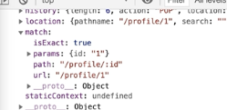

# [react] React Router

강의: 패스트캠프
메모: react-router-dom && query-string
생성일: 2022년 2월 22일 오전 11:19
수정일: 2022년 2월 23일 오후 5:06
스킬 & 언어: react
중요도: 💜💜

# React 라우팅 이해

기존엔 서버로부터 해당 url에 대한 정보를 받아왔지만 현재는 (SPA) 큰 앱을 받아와 브라우저에서 url에 따라 보여줄 페이지를 요청해 내부에서 선택해 보여주는 방식을 취하고 있다.

## spa 라우팅 과정

1. 브라우저에서 최초로 `/` 경로(루트경로)로 요청하면 react web app 을 내려준다.
2. 내려받은 React App에서 브라우저는 `/` 경로에 맞는 컴포넌트를 보여준다.
3. React App에서 다른 페이지로 이동하는 동작을 수행하면 새로운 경로에 맞는 컴포넌트를 보여준다.

**_→ 이런 역할은 리액트 기본 앱이 해줄 수 없다. 그래서 이런 역할을 도와줄 패키지가 react-router-dom!!_**

컴포넌트를 작성 → 효율적인 랜더 → 컴포넌트 및 url 전환 로직 등등

## react-router-dom 설치 및 사용방법

`npm i react-router-dom`

- cra에 기본 내장된 패키지가 아니다.
- 페이스북의 공식 패키지는 아니다.
- 가장 대표적인 라우팅 패키지

```jsx
npx create-react-app react-router-example //리액트 app 설치
cd react-router-example
npm i react-router-dom
code .
```


요청한 경로에 path가 들어있으면 해당 컴포넌트를 보여준다. → `/` Home을 보여주기 때문에 프로필과 어바울을 연결할 때 슬래시가 포함되어 있기 때문에 홈+프로필, 홈+어바웃을 보여주고 있다.

현재는 포함되어있다면!!! 보여주고 있는데 이것이 아닌 **_같을 때 url을 연결하고 싶다면 아래와 같이 작성한다._**

```jsx
<Route path="/" exact component={Home} />
<Route path="/about" component={About} />
```

- `exact` 를 작성한다!!!!
- 하위 메뉴를 만들 때!! (e.g `/about/aboutmenu`) exact를 작성하지 않는다면 중복되어 발생되기 때문에 하위 메뉴를 만들 때에도 동일하게 exact를 작성해야 한다.

# Dynamic Routing

### 동적으로 입력하는 방식 → 대메뉴/:소메뉴

```jsx
import { BrowserRouter, Route } from "react-router-dom";
import Home from "./pages/Home";
import Profile from "./pages/Profile";
import About from "./pages/About";

function App() {
  return (
    <BrowserRouter>
      <Route path="/" exact component={Home} />
      {/* 소메뉴를 생성했기 때문에 중복을 줄이기 위해 exact를 작성한다!! */}
      <Route path="/profile" exact component={Profile} />
      {/* ↓ www.____/progile/1 과 같은 주소로 표현하고 싶을 때 이 1의 이름을 지정해줘야 한다. */}
      <Route path="/profile/:id" component={Profile} />
      <Route path="/about" component={About} />
    </BrowserRouter>
  );
}

export default App;
```

`path="/profile/:id"` profile이라는 컴포넌트로 연결이 된다. 사용하기 전 컴포넌트 내부에 id에 대한 설정을 먼저 작성해줘야 한다.



```jsx
//props를 통해 들어오기 때문에 props를 작성해준다. 프로파일 컴포넌트의 props만 받아올 수 있다.
export default function Profile(props) {
  const id = props.match.params.id;
  console.log(id, typeof id);
  {
    /*1, String*/
  }

  return (
    <div>
      <h2>Profile 페이지입니다.</h2>
      {id && <p>id 는 {id} 입니다.</p>}
      {/*id가 있을 때 p태그가 표시되어야 하기 때문에 id가 있으면 표시된다는 의미로 {} 내부에 작성!! 및 && 사용*/}
    </div>
  );
}
```

1. url 에 소메뉴를 넣으려고 한다면 `Route path=”대메뉴/:소메뉴들 모음 이름”` 과 같이 작성해준다.
2. props 내부엔 프로퍼티 키가 세가지가 있다.
   1. `props.match.params.id`
   2. id는 직접 지정한 프로퍼티 키이다. 그에 해당하는 값으로 1이 들어왔다.

## ?name=mark, 쿼리스트링

name을 사용해 값을 꺼내오는 방식

```jsx
// src/pages/About.jsx

export default function About(props) {
  const searchParams = props.location.search;
  console.log(searchParams);

	const obj = new URLSearchParams(SearchParams);
  console.log(obj.get("name"); //mark
// 브라우저 내장 객체(IE X), method를 기억하고 사용해야 한다.

  return (
    <div>
      <h2>About 페이지 입니다.</h2>
    </div>
  );

}
```

**URLSearchParams (내장객체)**

- 단점
  - 브라우저 내장 객체기 때문에 사용 불가능한 브라우저가 있다.
  - 메소드를 기억하고 사용해야 한다.
  - 바로 사용이 불가능하고 `new URLSearchParams(SearchParams).get("name")` 와 같이 프로퍼티 키로 값을 꺼내서 사용해야 한다.
- 단점 극복

  - `npm i query-string -S`
  - 1, 3 번째 단점을 극복할 수 있다.

  ```jsx
  // src/pages/About.jsx

  import queryString from "query-string"; // 라이브러리 임포트

  export default function About(props) {
    const searchParams = props.location.search;
    const query = queryString.parse(searchParams);
    return (
      <div>
        <h2>About 페이지 입니다.</h2>
        {query.name && <p>name 은 {query.name} 입니다.</p>}
      </div>
    );
  }
  ```
