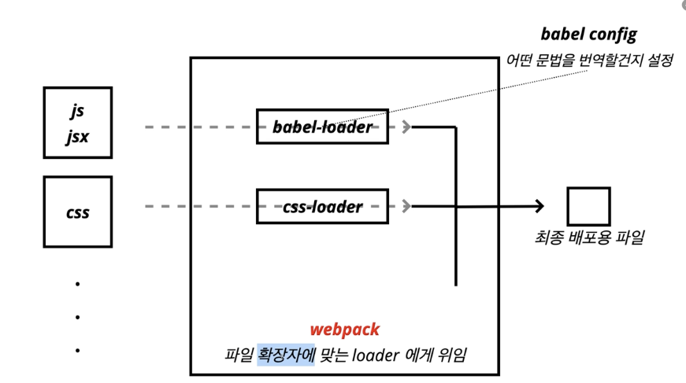

# [react] creat React App

강의: 패스트캠프
생성일: 2022년 2월 21일 오후 4:43
수정일: 2022년 2월 22일 오전 2:07
스킬 & 언어: react
중요도: 💜💜

# Create React App

- 프로젝트 생성하기

create-react-app을 통해 만든 프로젝트는 node 기반의 프로젝트이기 때문에 pakage.json 파일이 존재한다.

```jsx
npx create-react-app 프로젝트이름
```

npx : npm5.2.0 이상부터 함께 설치된 커맨드라인 명령어 → 최신 버전의 라이브러리를 확인해서 실행해준다.

```jsx
"scripts": {
    "start": "react-scripts start", // 개발모드를 로컬에서 실행시킬 수 있게 해준다.
    "build": "react-scripts build", //
    "test": "react-scripts test",
    "eject": "react-scripts eject"
  },
```

`npm run build` : 작업한 소스코드를 작게 만들어준 후, 빌드 폴더에 생성된다.

```jsx
npx serve -s build //서버가 로컬에 뜨게 된다.
// -s는 어떤 라우팅을 요청해도 index.html이 응답하도록 한다.
// singlepage app의 약자
npm install serve -g // serve를 전역으로 설치한다.
```

빌드 폴더를 서버로 만들어 개발 모드가 아닌 빌드 모드로 해당 웹 사이트를 실행시켜준다.

- 소스코드를 변경시키고, 빌드 폴더 내부에 모든 코드가 들어간다.

```jsx
npm test
```

jest를 통해 test code를 실행한다.

```jsx
npm run eject
```

되돌릴 수 없기 때문에 정말로 진행할 것인지를 묻는다.

create-react-app에서 코드를 꺼내 해당 create-react-app의 영향권에서 벗어나도록 설정하는 명령어

→ 리액트내에서 해결할 수 없는 설정을 추가해야 할 때, 자유로운 커스텀을 사용하기 위하여

## CRA을 통해 리액트 프로젝트를 볼 수 있는 과정



# ESLint

- CRA을 설치하면 ESLint가 설치된다.
- 내부적인 규칙들을 설정하고, 틀렸을 때 메세지를 보내준다.
- 리액트 뿐만 아닌 js 등 다른 곳에도 존재!

```jsx
mkdir eslint-test
cd eslint-test
npm init -y
npm install eslint -D
```

라이브러리 설치

```jsx
npx eslint --init //초기화
```

그 후 세부 조건을 설정하면 .eslintrc.확장자(e.g json, yarm, js) 로 파일이 생성된다.

- `rules :{}` 내부에 조건을 작성하면 된다.
  - 조건은 해당 사이트를 접속하면 자세히 기재되어 있다.

```jsx
npx eslint index.js //로 문제가 있는지 없는지 확인할 수 있다.
npx eslint index.js --fix //바로 수정 가능함!
```

하지만 이 방법은 매우 번거롭다..! → 플러그인 추천 vscode : ESLint

# Prettier

```jsx
mkdir prettier-test
cd prettier-test
npm init -y
npm i prettier -D //런타임에 사용되는 패키지가 아니기 떄문에 -D로 함!
```

```jsx
npx prettier index.js // 확인
// console.log('hello') -> console.log("hello");

npx prettier index.js --write // 바로 수정
```

마찬가지로 플러그인이 가능하다!

만약 “”가 아닌 ‘’ 처럼 기본 설정되어 있는 코드가 아니라 따로 수정을 하고 싶다면 `.prettierrc.json` 파일을 만들어 설정을 변경한다.

```jsx
{
	"singleQuote":true
}
// 와 같이 작성한다. json 뿐만이 아닌 다양한 확장자도 가능하다.
```

# husky

깃 훅을 쉽게 사용하게 도와주는 패키지

```jsx
mkdir husky-test
cd husky-test
npm init -y
git init // 깃이 설치되지 않을 땐 허스키를 설정할 수 없다!!
npm i husky -D
```

code - terminal

```jsx
npx husky install // git hook install
```

pakage.json

```jsx

"script":{
	"prepare":"hesky install",
	"test" : "~~~~~~~ exit 1"
}
```

pakage.json에 prepare를 추가한다.

```jsx
npx husky add .husky/pre-commit "npm test"
```

commit을 작성하기 전에 허스키(npm teat)를 실행하려고 함!

→ 하지만 지금 사용한 test는 exit 1으로 끝나기 때문에 코드를 제대로 실행하지 못하고 커밋이 되지 않는다!

**허스키는 왜 사용할까?**

- 깃에 push 하기 전, exLint, prettier등을 확인한다면 자잘하게 생기는 오류들을 깃에 push하기 전에 잡아낼 수 있기 때문에!
- 팀프로젝트에도 좋다.

# lint-staged

커밋을 하기 직전 elint, prettier를 통해 오류를 잡을 수 있게 설정하자.

```jsx
npm i huskey -D
npx huskey install
code .
```

pakage.json

```jsx
"script":{
	"prepare":"husky install",
}
```

terminal - hook i

```jsx
npx huskey add .huskey/pre-commit "lint-stageed"
npm i lint-staged -D
```

```jsx
"lint-staged" : {
	"**/*.js" : [ //js확장자를 가진 파일이 스테이지에 올라와있다면
		"eslint --fix", //eslint를 fix하고
		"prettier --write", //자동으로 설치가 안 되기 떄문에 -D로 설치해야 함
		"git add" //깃 add
	]
}
```
