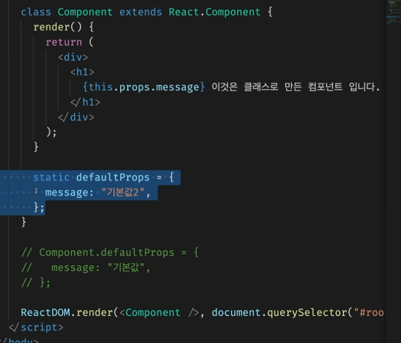
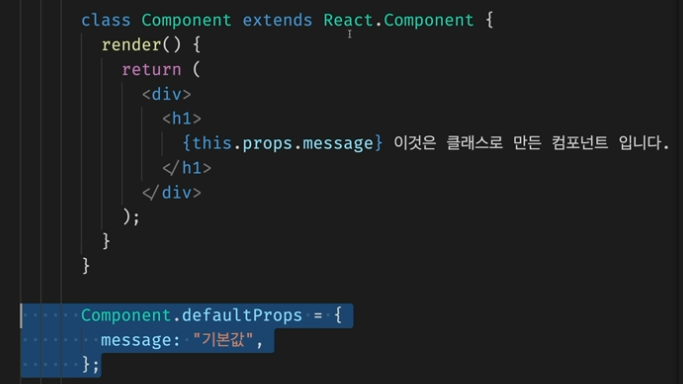

# [state & props] how to use state and props of class component &  function component

강의: 패스트캠프
생성일: 2022년 2월 4일 오후 3:58
수정일: 2022년 2월 4일 오후 11:01
스킬 & 언어: react
중요도: 💜💜

***최종 정리***

- props는 class, funtion component 모두 사용이 가능하다.
- state는 class component에서만 사용할 수 있지만, function은 react hook 을 통해 동일한 기능을 사용할 수 있다. → **state 값이 변경되면 리랜더링되어 값이 자동으로 변환되는 기능**

***참고***

- fastcampus - Part 10. React - ch2.React Component - 03. Props와 State

---

# Props와 State

변경이 발생되면 render가 다시 발생될 수 있다. 

**Props** :

- 컴포넌트 외부에서 컴포넌트에게 주는 데이터

**State** :

- 컴포넌트 내부에서 변경할 수 있는 데이터

**render** :

- Props와 State를 바탕으로 컴포넌트를 그림 → 변경되면 해당 component를 다시 실행하여 변경된 Props와 State를 다시 표시된다

---

## props

- component의 인자로 작성

### function component - props

```jsx
// {message:'안녕하세요'} 객체가 하단 props에 인자로 들어간다.
function Component(props){ //props 자체가 인식됨
        return (<div><h1>{props.message}이것은 함수로 만든 컴포넌트 입니다.</h1></div>);
									// render에서 작성한 message가 {props.message} 를 통하여 인식되게 된다.

      }
      
      ReactDOM.render(<Component message="안녕하세요" />, document.querySelector("#root"))
//message="안녕하세요" 가 다른 문구로 변경된다면 Component 영역 또한 리랜더링되어 새로운 값이 불러와진다.
```

### class component - props

```jsx
class Component extends React.Component{
          render(){ //function component와 달리 render에 인자로 들어가는 것이 아님을 알 수 있다.
            return (<div><h1>{this.props.message} 이것은 함수로 만든 컴포넌트 입니다.</h1></div>);
						// 인자로 들어오는 것이 아니기 때문에 this를 사용하여 직접적으로 작성해준다.
          }
        }
        ReactDOM.render(<Component message="안녕하세요" />, document.querySelector("#root"))
```

`message=”안녕하세요”` 와 같이 직접 작성하지 않고 기본적으로 내장되어 있기를 바랄 때는 DefaultProps 기능을 사용한다. 

- 단, 직접 지정하지 않은 작성하지 않았을 때의 기본값이기 때문에 직접 지정을 했다면 해당 DefaultProps는 표시되지 않는다.
- 코드 전체보기
    
    방법1
    
    
    
    방법2
    
    
    

```jsx
// 직접 지정하는 방식, component 선언 외부에서 작성
//class, function 모두 사용 가능
Coponent.defaultProps = {
	message:"기본값",
}

// coponent 선언 내부에 작성
// class에서만 사용이 가능하다.
static defaultProps ={
	message:"기본값",
}
```

## state

hook이 아닌 일반 state는 class에서만 사용이 가능하다.

후에 hook을 사용하면 function 방식에서도 state를 사용할 수 있다.

```jsx
ReactDOM.render(<Component message="안녕하세요" />, document.querySelector("#root"))
        state=
        {
          count:0,
        }
        class Component extends React.Component{
          render(){
            return (
              <div>
              <h1>{this.props.message} 이것은 함수로 만든 컴포넌트 입니다.</h1>
              <p>{this.state.count}</p>
              </div>
              );
          }
        }

        componentDidMount={
          setTimeout( ()=>{
            // 직접 작성한다고 하여 리랜더링되어 반영되는 것이 아님!!
            // this.state.count = this.state.count+1;

						// setState라는 내장함수를 호출해 사용해야 한다.
            this.setState({
              count:this.stat.count+1,
            });
          },1000);
        }
```

- state는 객체 형식으로 입력해야 한다.
- setState 함수를 호출한 후 내부에 작성해야 자동으로 랜더링이 발생된다.

1. state 정의  `state= {count:0,}` → **state 초기값 설정** 
    1. 방법 2 : React.Component의 생성자 함수를 호출하여 state 정의
    
    ```jsx
    constructor(props){ // 생성자함수, 최초의 props를 받아 생성자 호출을 진행
    	super(props); // super 키워드 호출
    	this.state = {count:0}; //state 초기화
    }
    ```
    
2. state를 render 메소드 내부에 작성 `{this.state.count}`
3. componentDidMount 라는 라이프사이클 훅을 통해 count(state)를 변경하는 코드를 작성
    1. 방법 1 : 객체를 통째로 생성
    
    ```jsx
    componentDidMount={
      setTimeout( ()=>{
        this.setState({
          count:this.stat.count+1,
        });
      },1000);
    }
    ```
    
    1. 방법 2 : 앞서 작성한 값을 그대로 사용할 수 있다.
    
    ```jsx
    componentDidMount={
      setTimeout( ()=>{
        this.setState((previosState)=>{
    			const newState = {count : previosState.count + 1}
    			return newState;
    		});
      },1000);
    }
    ```