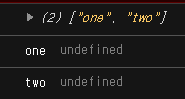
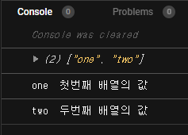

# [반복문] for in / for of 비교

생성일: 2022년 1월 31일 오후 7:44
수정일: 2022년 1월 31일 오후 10:54
스킬 & 언어: js, 기본 지식

***최종 정리***

- for in은 프로토체인을 포함한 배열 내 모든 요소를 반복시킬 수 있으나 for of는 프로토체인이 포함되지 않은 배열의 값만을 반복시키며, 인덱스 값은 표시되지 않는다.

***오늘 진도***

- 반복문을 돌리기 위한 조건
- for in, for of차이
- 배열이 아닐 때 for in, for of를 사용하기 위한 객체를 배열로 바꾸는 함수

---

# 반복문

반복문(Iteration)은 일정하게 되풀이되는 문법으로 일반적으론 배열을 반복하며, Array외에 String, Map, set 등의 객체에서도 반복문을 사용할 수 있다.

→배열 외에 다른 객체들에 박복문을 사용할 수 있는 이유는 **Iterable & Iterator가 존재**하기 때문이며, ***이 두가지의 프로토콜이 모두 존재해야만 반복문을 수행할 수 있다.***

### Iterable

- **반복가능한 객체** → 조건 확인
- **객체에 symbol.iteraoter가 존재해야함. → iterator객체를 반환해야 함**
    
    → symbol.iteraoter가 존재하지 않을 때 iterabel을 할 수 있다면 프로토타입에 의해 부모에게 존재한다면 가능하다!
    

### iterator

- 반복을 실행하는 반복기 → iterabel 객체가 반복하면서 어떤 값을 반환할 것인지를 결정하게 된다.

# for in, ior of 비교

반복이 가능한 객체에서 추출하여 변수에 담아 반복문을 수행하는 것은 동일하나 **`for-in`은 iterabel한 객체라면 모두 반복할 수 있지만 `for of`는 프로토체인에 의한 iterabel object는 반복할 수 없다.**

### for-in

- iterabel object라면 배열 내부에 있는 모든 요소를 반복시킨다.
- console.log를 확인할 때 임시 변수에 담은 배열의 인덱스값과 실제 값이 함께 출력된다.

### for of

- 프로토체인에 의한 프로퍼티는 무시한다. → undefined가 표시된다.
- console.log를 확인할 때 임시 변수에 담은 실제 값만 출력된다.
- 객체(object)와 같은 요소는 for of로 반복시킬 수 없다.

# 객체에 for in, for-of를 사용할 때

`object.key()` → 객체의 프로퍼티를 배열로 변환하는 함수이다.

```jsx
let obj= {
    one : "첫번째 배열의 값",
    two : "두번째 배열의 값"
}
let arr= Object.keys(obj);
console.log(arr)

for(let value of arr){
    console.log(value, obj[value])
}
```



`obj[value]`



`obj.value`

- `object.key()`는 프로퍼티 키를 배열로 반환하는 함수로 arr 안에는 one, two가 배열로 담겨있다. → 따라서 for of를 돌릴 수 있다.
- 프로퍼티 값을 확인하고 싶다면 배열로 바꾸지 않은 객체 그대로의 `obj[value]`로 확인이 가능하다.
    - `obj.value`는 undefined가 나온다.