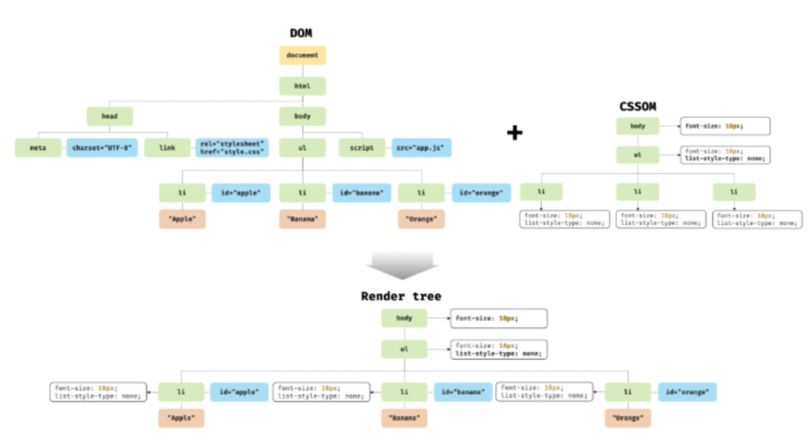
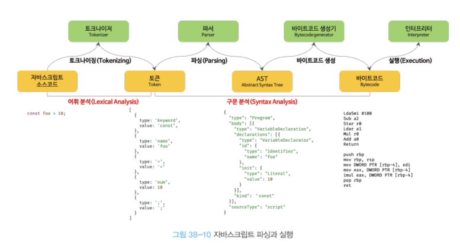
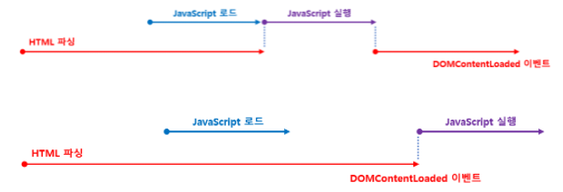
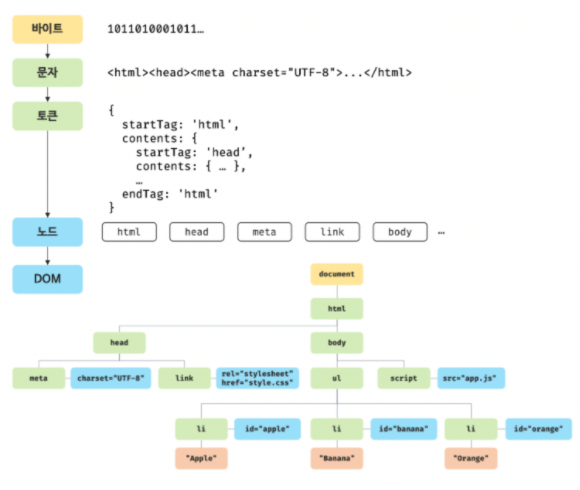

# 브라우저 렌더링 과정

강의: 블로그 및 도서
생성일: 2022년 1월 22일 오후 1:34
수정일: 2022년 1월 27일 오전 12:10
스킬 & 언어: 기본 지식

node.js의 등장으로 js는 웹 브라우저가 아닌 서버사이드 애플리케이션 개발에서도 사용할 수 있는 개발 언어가 되었지만 js가 가장많이 사용되는 분야는 웹 브다루저 환경에서 동작하는 웹 페이지 / 어플리케이션의 클라이언트 사이드 이다.

→ node.js : 구글의 V8 JS엔진으로 빌드된 JS 런타임 환경

- **파싱**

파싱은 또 다른 이름으로 **구문분석**이라고 한다. 프로그래밍 언어의 문법에 맞게 작성된 텍스트 문서를 읽고 실행하기 위해 ***텍스트 문서의 문자열을 토큰으로 분해하여 어휘 분석하고 문법적 의미와 구조를 반영하여 트리 구조의 자료 구조인 파스트리를 생성하는 일련의 과정을 말한다.***

`token` 문법적으로 더이상 하눌 수 없는 코드의 기본 요소

- **랜더링**

html, css, js로 작성된 문서를 파싱하여 브라우저에 시각적으로 출력하는 것

- **블로킹**

html의 구문분석이 js에 의해 차단된다. 차서가 내부 혹은 외부 script태그에 도달하면 가져오기 및 실행을 중지

---

### 브라우저의 랜더링 과정 (요청과 응답)

- 브라우저의 핵심 기능은 필요한 리소스를 서버에 요청하고 서버로부터 응답받아 브라우저에 시각적으로 렌더링하는 것이다.

→ 랜더링에 필요한 리소스는 모두 서버에 존재한다. 렌더링에 필요한 리소스를 서버에 요청하고 서버가 응답하면 해당 리소스를 파싱하고 해석하여 렌더링하는 것 이때!! 웹에서 브라우저와 서버가 통신하기 위해 정해진 프로토콜(규약)이 있는데 이것이 http 이다.

### HTTP1.1 / HTTP 2.0의 차이

HTTP는 웹에서 브라우저와 서버가 통신하기 위한 프로토콜(규약)을 의미한다.

- HTTP1.1은 기본적으로 커넥션당 하나의 요청과 응답만 처리한다. 그래서 리소스의 개수에 비례하여 응답 시간도 증가한다는 단점이 있다.
- HTTP 2.0는 여러애긔 요청과 응답이 가능하다. HTTP 1.1에 비해 페이지 로드 속도가 약 50% 증가하였다.

### HTML파싱과 DOM생성

→ 브라우저 요청에 의해 서버가 응답해서 받아온 HTML 문서는 단지 문자열로 이루어진 텍스트일 뿐이다. 따라서 순수한 텍스트를 브라우저에서 시각적으로 출력 및 렌더링을 진행하기 위해서는 ***브라우저가 이해할 수 있는 자료구조인  DOM(document object model)의 객체로 변환하여 메모리에 저장***해야 한다.

1. html 파일을 브라우저에서 요청
2. 서버의 응답 (서버는 브라우저가 요청한 html파일을 2진수의 바이트 형태로 메모리에 저장)
3. 브라우저는 서버가 응답한 HTML 문서를 바이트 형태로 응답받고, 이 문서는 META 태그의 charset 속성에 의해 지정된 인코딩 방식(UTF-8) 을 기준으로 문자열로 변환
4. 문자열로 변환된 HTML 문서를 토큰으로 분해한다.
5. 토큰들은 객체로 변환하여 노드를 생성.
6. HTML요소들의 집합으로 이루어지며 중첩관계를 갖는다. 이러한 요소간에 존재하는 부자관계를 반영한 노드를 트리 자료구조로 구성한다. → DOM

***❇️ DOM은 HTML 문서를 파싱한 결과물이라고 할 수 있다.*** 

### CSS파싱과 CSSOM생성

`DOM생성` : HTML문서를 한 줄 씩 순차적으로 파싱하여 브라우저가 이해하는 객체를 생성해 나가는 것

`CSSOM생성` : CSS파일을 로드하는 link, style 태그를 이용하여 css를 로드, 파싱하는 것을 CSSOM(css Object Model) 이라고 한다.

→ DOM을 생성하다 link, style 속성과 만나면 DOM 생성을 일시중단하고, css 파일을 서버에 요청하여 로드 → css 파싱이 완료되면 다시 html 파싱이 이어지며 DOM 생성이 재시작된다.

### 렌더 트리 생성

렌더링 엔진이 서버로부터 응답된 HTML과 CSS파일을 파싱하여 DOM, CSSOM을 생성한 다음 렌더링을 위해 렌더트리로 결합된다.

`렌더트리` : 브라우저 화면에 렌더링 되는 노드만으로 구성된 트리 구조의 자료 구조이다.

- 따라서 브라우저 화면에 렌더링되지 않는 노드인 meta태그, script 태그, css 상에서 dispaly:none이 적용된 노드들은 렌더트리에 포함되지 않는다.

- 완성된 렌더트리는 HTML요소의 레이아웃을 계산하는데 사용, 브라우저 화면에 픽셀을 렌더링하는 페인팅처리에 입력된다.

***브라우저의 렌더링 과정***

1. JS에 의해 노드가 추가, 삭제되었을 때
2. 브라우저 창 크기, 뷰포트 크기가 변경되었을 때
3. HTML요소의 레이아웃을 변경하는 CSS코드가 변경됐을 때

레이아웃 계산과 페인팅이 (리렌더링) 실행된다. 이는 비용과 성능에 악영향을 주므로 가급적 빈번하게 일어나지 않도록 주의해야한다.

### 자바스크립트 파싱과 실행

***JS는 이미 생성된 DOM을 동적으로 조작할 수 있는 DOM API를 제공한다.***

렌더링 엔진은 HTML을 한줄 씩 순차적으로 파싱하여 DOM을 생성하다 JS파일을 서버에 여청해야하는 script 태그나 JS를 콘텐츠로 탐은 script 태그를 만나면 DOM 생성을 일시중단한 후 script의 src 속성에 정의된 JS파일을 서버에 요청하거나 JS코드를 파싱하기 위해 JS엔진에 제어권을 넘긴다. → 이후 JS 코드의 파싱이 종료되면 렌더링 엔진에게 제어권이 넘어가 HTML 파싱이 종료된 지점부터 HTML파싱이 시작된다.

- `토그나이징`

JS소스코드를 JS엔진이 해석하기 시작한다. 이를 토그나이징이라고 하는데 단순한 문자열인 JS코드를 어휘분석하여 문법적의미를 갖는 토큰들로 분해한다.

- `파싱`

토큰들의 집합을 구분문석하여 AST(추상적 구문 트리)를 생성한다. → *토큰에 문법적 의미와 구조를 반영한 트리 구조의 자료구조!*

- `바이트코드 생성과 실행`

파싱의 결과물로 생성된 AST는 인터프리터가 실행할 수 있는 바이트코드로 변환, 인터프리터에의하여 실행된다.

### 리플로우, 리페인트

`리플로우(reflow)` : 생성된 DOM, CSSOM을 변경하는 DOM API가 사용된 경우 노두의 레이아웃 자체가 변경 혹은 영향을 받기 때문에 모든 노드의 수치를 다시 계산하여 렌더트리를 재생성한다. → ***레이아웃 계산을 다시하는 것을 의미하며 발생 시 변경된 DOM, SSOM은 다시 렌더트리로 별합된다.***

→ 레이아웃에 변화를 주는(width, height, padding, margin, float etc.) 레이아웃의 영향을 주는 속성이 변경되었다는 의미

`리페인트(repaint)` : 리플로우 과정이 끝나고 재결합된 렌더트리를 다시 그리는 작업을 의미

→ 리플로우와 리페인트는 반드시 순차적으로 진행되는 것이 아니다. 레이아웃의 변경이 없을 때에는 리플로우 없이 이페인트만 진행되기 때문!

### JS파싱에 의한 HTML파싱 중단

렌더링 엔진과 JS엔진은 병렬적 파싱이 아닌 직렬적 파싱이 이루어진다. (→ `동기적`, 위에서 아래로 `순차적`, html, css, js 로 `직렬적`)

→ 브라우저가 순차적으로 파싱하기 때문에 script의 위치에 따라 HTML 파싱이 블로킹되어 DOM생성이 지연될 수도 있다.

→ **해결하기 위한 방법** : script를 body 하단에 작성한다.

`블로킹` : JS 파싱에 의해 DOM생성이 중단되는 것

앞서말한 JS파싱에 의한 HTML 파싱 중단의 문제를 해결하기 위해 HTML5부터는 `async`, `defer` 속성이 추가되었다. ***(IE10 이상부터 지원됨)***

- 외부 JS파일을 로드하는 경우에 사용한다. (→scr 속성을 사용할 때 사용함!)
- `async` `defer` 를 사용하면 html파싱과 외부 JS파일 로드가 비동기적으로 진행된다.

`async` : js의 로드는 html 파싱과 동시에 진행되지만 js의 실행은 html파싱을 중단시킨 후 진행된다.  

`defer` : js의 파싱과 실행은 html파싱이 완료된 직 후에 진행된다. 따라서 defer 속성은 dom 생성이 완료된 이후 실행되어야 할 js에 사용하게 된다.

### uri, url, urn 비교

| URI(Uniform Resource Identifier) | URL(Uniform Resource Locator) | URN(Uniform Resource Name) |
| --- | --- | --- |
| - 통합 자원 식별자의 줄임말
- 검색창을 클릭하면 나타나는 주소
- 인터넷에 있는 자원을 나타내는 유일한 주소
- RUI ⊃ URL, URN | - 네트워크 상에서 웹페이지, 이미지, 동영상 등의 파일이 위치한 정보를 의미
- http 프로토콜을 포함한다.
- scheme, hosts, url-path

어떻게 리소스를 얻을 것이고, 가져와야 할 곳을 명시하는 URI | - http 프로토콜을 포함하지 않는다.

어떻게 리소스에 접근할 것인지 명시하지 않고, 경로와 리소스 자체를 특정하는 것을 목표로하는 URI |