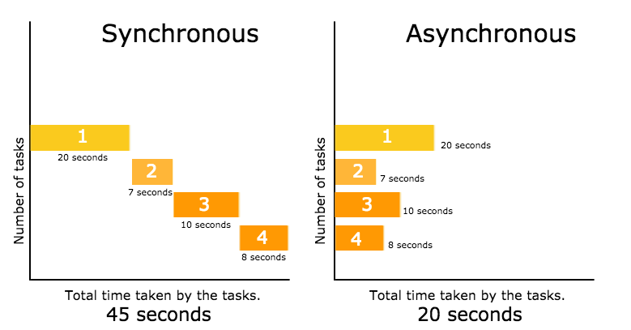
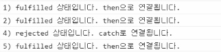

# async, await - 비동기처리

강의: 블로그 및 도서
생성일: 2022년 1월 27일 오전 12:11
수정일: 2022년 1월 27일 오후 11:28

---

JS는 기본적으로 작업이 종료되어야 다음 작업이 진행되는 동기처리 방식의 언어이다. 따라서 외부데이터를 불러오는 것과 같은 긴 시간이 필요한 작업을 진행해야 할 때에는 동기처리 방식의 진행은 어려움이 따른다.

→ 비동기 처리를 진행하면 코드를 실행하는 흐름이 멈추지 않기 때문(데이터를 불러오는 시간을 기다릴 필요가 없음)에 동시에 여러 작업을 수행할 수 있고, 기다리는 도중 다른 함수를 호출할 수도 있다.

- ***싱글스레드인 JS가 다중스레드인 비동기식 처리를 할 수 있는 이유***
  
    JS는 싱글스레드로 동작하는데 비동기 처리 시에는 다중 스레드가 동작하는 멀티 태스킹 작업이 필요하다. 싱글스레드인 JS에서 비동기처리를 할 수 있는 이유는 **웹브라우저나 Node.js에서는 JS를 돌리는 하나의 스레드가 존재하는데 (비동기식 처리모델 web API) web API가 JS의 스레드와 함께 동작하면서 비동기로 처리해 JS엔진으로 data를 돌려보내준다.**
    



함수가 작업되는 동안에 다른 작업을 함께 수행하고 싶을 때에는 비동기적으로 처리를 진행해주어야 한다.

***비동기 처리를 진행하는 방법***

→ `ajax`, `setTimeout`, `Promise`, `async`, `await` etc.

### setTimeout

setTimeout의 첫번째 인자는 콜백함수를, 두번째 인자는 시간을 적는다. 이것은 그 시간이 흐른 후에 첫번째 인자로 적은 함수를 실행하겠다는 뜻이다. 

### Promise / ES7

기본적으로 콜백함수와 하는 일은 동일하나 Promise는 작업이 종료된 후 실행할 함수를 제공하는 것이 아닌 자체 메소드인 `.then()` 을 호출한다.

`.then()` 을 연속적으로 사용할 수 있으며, 콜백함수를 사용했을 때와는 달리 가독성이 좋다는 장점이 있다.

작업이 실패 했을 경우 자동으로 `.catch()` 메소드를 호출한다.

- **++**  `**.then` 과 `.catch`는 새로운 Promise를 반환한다. → 비동기 동작을 연결시킬 수 있다.**
  
    ```jsx
    var test = function(bool){
        return new Promise(function(resolve, reject){
            setTimeout( function(){
                if(bool){
                    resolve("fulfilled 상태입니다. then으로 연결됩니다.");
                }
                else{
                    reject("rejected 상태입니다. catch로 연결됩니다.");
                }
            }, 1000)
        })
    }
    
    test(true)
    .then( function(result){
        console.log("1) " + result);
        return test(true);
    })
    .then( function(result){
        console.log("2) " + result);
        return test(false); // ★ Promise test의 false를 호출했다. then은 true 시에 호출 되는 메소드이기 때문에 3번 then이 아닌 4번 catch가 반환되었다.
    })
    .then( function(result){
        console.log("3) " + result);
        return test(true)
    })
    .catch( function(result){
        console.log("4) " + result);
        return test(true)
    })
    .then( function(result){
        console.log("5) " + result);
        return test(true)
    })
    ```
    
    
    
    **3이 호출되지 않은 이유는 두번째 then에서 다음 Promise를 반환할 때 false로 값을 반환시켰기 떄문에 세번째 then은 resolve가 아닌 reject를 반환하여 catch가 실행되었다.**
    

→ .catch메소드를 호출했다고 하여 종료되는 것이 아닌 새로운 Promise를 반환한다는 것을 기억해야 함!

```jsx
function fnPromise(a) {
  return new Promise(resolve => setTimeout(() => resolve(a + 10), 100));
} // Promise사용 시 작업이 끝났음을 알려주는 resolve를 인자로 받아들임.
fnPromise(10)
  .then(fnPromise)
  .then(fnPromise)
  .then(fnPromise)
  .then((res) => console.log(res))
```

```jsx
fnPromise(10)
  .then((res) => {
        throw 'error';
// 문자열 값을 가지는 예외가 발생
    })
  .catch((err) => console.log(err));
```

**`throw`**문은 사용자 정의 예외를 발생(throw)할 수 있다. → 에러를 발생시키고 싶을 때 사용!

Promise는 세가지 상태, 두가지 메소드를 갖고 있다.

***세가지 상태***

- `대기중 (pending)` : 아직 결과가 나오지 않은 상태
- `이행됨 (fulfilled)` : 비동기처리가 성공된 상태, 결과로 하나의 값이 전달
- `거부됨 (rejected)` : 비동기 처리가 실패된 상태, 결과로 거절된 이유를 전달

두가지 메소드

- `.then` : 약속이 완료됐을 때 호출될 함수를 정의, 첫번째 인자는 약속이 성공적으로 이행됐을 때 호출되고, 두번째 인자는 실패됐을 때 호출된다. 인자 함수들은 매개변수를 가지는데 매개변수를 통해 전달된다.
- `.catch` :  약속이 거부되었을 때 호출될 함수를 등록

```jsx
//1초 뒤에 성공하는 Promise 예시
const fnPromise = new Promise((resolve, reject) => {
		setTimeout(() => {
			resolve('result');
		}, 1000) 
	});

	fnPromise.then(result =>
		console.log(result);
	});
```

```jsx
// 1초뒤에 실패하는 Promise 예시
const myPromise = new Promise((resolve, reject) => {
		setTimeout(() => {
			reject(new Error());
		}, 1000)
	});

	myPromise.then(result => {
		console.log(result);
	}).catch(e => {
		console.log(e);
	})
```

Promise를 이용하면 콜백함수보다 간결하고 직관적인 가독성을 가지며, 코드가 깊어지지 않는다. 하지만 어떤 지점에서 에러가 발생했는지 명확하게 파악하는 것이 어렵고, 코드를 나눠야 할 때에 then으로 이어지는 형태이기 때문에 코드를 나누는 것이 번거롭다.

### async, await / Node.js 7.6~

*→ 비동기 코드를 동기적으로 ( 마치 .then() )사용하게 해주는 것이 async, await 이다.*

promise보다 비교적 쉽게 비동기 상황을 표현할 수 있다. *async함수 내부에서 await을 사용한다.*

await은 함수의 작업이 끝나고 결과값을 반환할 때까지 대기하게 되며 결과값이 반환됐을 떄 다음작업이 진행된다.

**함수 앞에 `async`라는 예약어를 작성하고, 함수의 내부 로직 중 HTTP통신을 처리하는 비동기 처리 코드 앞에 `await`을 붙인다.** → *이렇게 작성하면 then으로 이어줄 핑요가 없다. 분기점 만드는 것이 용이함! 또한 변수를 사용하기 때문에 변수의 공유가 간편해져 로직을 작성하는 것이 비교적 간단하다.*

(일반적으로 **await의 대상이 되는 비동기처리 코드는 프로미스를 반환하는 API 호출 함수**이다.)

```jsx
function fnPrimse() {
  return new Promise(function(resolve, reject) {
    const items = [1,2,3];
    resolve(items)
  });
}

async function logItems() {
  const resultItems = await fnPrimse();
  console.log(resultItems);
}
```

- `fnPrimse`는 프로미스 객체를 반환하는 함수
- `fnPrimse` 함수를 실행하면 결과값 배열인 items가 반환된다.
- `logItems`을 실행하면 `fnPrimse` 결과값이 `resultItems` 에 할당된다. 따라서 콘솔창엔 `items` 배열이 출력된다. //[1,2,3]

```jsx
async function fnAsync() {
  const a = await fnPromise(10).then(res => res);
  const b = await fnPromise(a).catch(err => err);
  console.log(a, b)
}
f2();
```

`fnPromise` 에서 Promise를 사용했기 때문에 promise의 메소드인 `.then`과 `.catch` 를 사용할 수 있다.

- await은 Promise를 받아 처리한다. → async는 Promise가 없으면 제대로 사용할 수 없다.
- await을 사용하기 위해서는 async 함수가 선언되어 있어야 한다.
    - 화살표 함수 및 함수 표현식, 함수선언식 사용이 가능하다.
- async는 return, throw값이 담긴 Promise를 리턴한다. (:then, catch여무에 따라 await으로 연결될 수도 있다.)

***async, await에서 예외를 처리하는 방법 : `try Catch`***

```jsx
async function logToDoTitile() {
  try {
    let user = await fetchUser();
    if (user.id === 1) {
      let todo = await.fetchTodo();
      console.log(todo.title); 
    }
  } catch (error) {
    console.log(error);
  }
}
```

→ Promise에서는 `.catch()`를 사용했다면 async, await에서는 `catch{}`

***Promise all, Promise.race***

동시에 여러개의 Promise를 처리하며, 사용방법은 동일하나 Promise all은 작성한 모든 함수가 실행되지만 Promise.rece는 가장 먼저 종료된 함수를 출력하는 차이가 있다.

```jsx
// Promise all
const fnOne= async () => {
    await sleep(500);
    return "첫번째 함수";
  };
const fnTwo= async () => {
    await sleep(1000);
    return "두번째 함수";
  };

async function process4() {
    const results = await Promise.all([fnOne(), fnTwo()]);
//비구조화 할당을 이용할 수도 있다.
//const [fnOne, fnTwo] = await Promise.all([fnOne(), fnTwo()]);
    console.log(results);
  }

  process4();
```

- 모든 Promise가 fulfiled 됐을 경우 → 배열로 결과 전달
- 한개 이상의 rejected가 발생된 경우 → reject된 이유를 반환

```jsx
// Promise.race
async function process6() {
		const results = await Promise.race([fnOne(), fnTwo()]);
    console.log(results );
  }

  process6(); //fnOne, "첫번째 함수"
```

1. 비동기 처리할 함수를 만든다.
2. 함수 앞에 async를 작성한다. `async function 함수명() {}`
3. Promise를 넣어줄 변수를 함수내에 선언한다. (e.g `results` )
4. Promise를 배열로 감싼 후에 Promise all 내부에 넣는다.
5. Promise all 앞에 await을 작성한 후에 results에 할당해준다.

- 참고 블로그
  
    [https://velog.io/@yunsungyang-omc/JS-비동기를-동기처럼-다루기](https://velog.io/@yunsungyang-omc/JS-%EB%B9%84%EB%8F%99%EA%B8%B0%EB%A5%BC-%EB%8F%99%EA%B8%B0%EC%B2%98%EB%9F%BC-%EB%8B%A4%EB%A3%A8%EA%B8%B0)
    
    [https://github.com/ekfka4863/TIL/blob/master/JS/JS-Basic/JS_비동기처리.md](https://github.com/ekfka4863/TIL/blob/master/JS/JS-Basic/JS_%EB%B9%84%EB%8F%99%EA%B8%B0%EC%B2%98%EB%A6%AC.md)
    
    [https://victorydntmd.tistory.com/49](https://victorydntmd.tistory.com/49)
    
    [https://victorydntmd.tistory.com/87?category=704012](https://victorydntmd.tistory.com/87?category=704012)